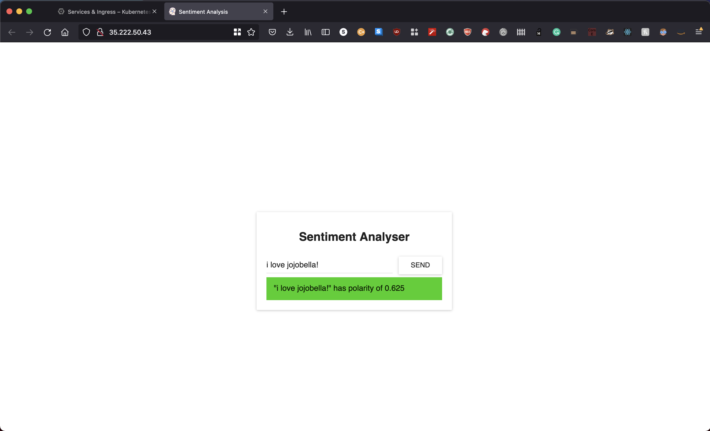
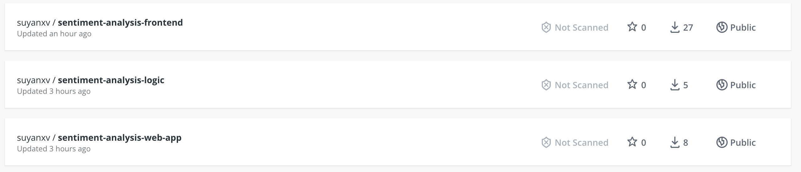
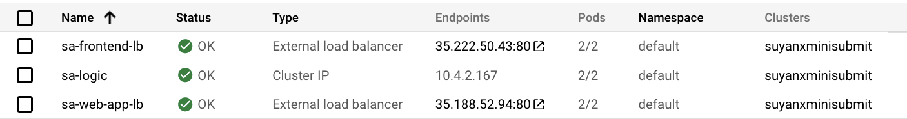
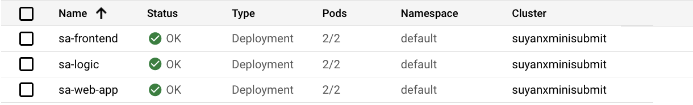

# README.md
## Video link
[demo_video.mov - Google Drive](https://drive.google.com/file/d/1T3RopVpNf_9oAQJmZNAonAEggSr2SEqF/view?usp=sharing)

## Docker images
https://hub.docker.com/r/suyanxv/sentiment-analysis-frontend

https://hub.docker.com/r/suyanxv/sentiment-analysis-logic

https://hub.docker.com/r/suyanxv/sentiment-analysis-web-app

## Screenshot of application execution on GKE


## Steps

### Following steps were done on local terminal
1. Clone the repository, go into repository
``` sh
git clone git@github.com:rinormaloku/k8s-mastery.git
cd k8s-mastery
```

2. `cd` into `sa-frontend` directory and install dependencies, then start application, then build application
``` sh
cd sa-frontend
npm install
npm start
npm run build
```

3. `cd` into `sa-webapp` directory, run maven to package application into a jar, run java application
``` sh
mvn install
cd target
java -jar sentiment-analysis-web-0.0.1-SNAPSHOT.jar --sa.logic.api.url=http://localhost:5000
```

4. `cd` into `sa-logic/sa` directory, 
``` sh
python -m pip install -r requirements.txt
python -m textblob.download_corpora
```

5. In terminal, export environment variables and log in docker with 
``` sh
export DOCKER_USERNAME=username
export DOCKER_PASSWORD=password
docker login -u=“$DOCKER_USERNAME” -p=“$DOCKER_PASSWORD”
```

6. In `sa-frontend`, add following lines to `.dockerignore`
```
node_modules
src
public
```
Then
``` sh
docker build -f Dockerfile -t $DOCKER_USER_ID/sentiment-analysis-frontend .
docker push $DOCKER_USER_ID/sentiment-analysis-frontend
```

7. In `sa-webapp`
``` sh
docker build -f Dockerfile -t $DOCKER_USER_ID/sentiment-analysis-web-app .
docker push $DOCKER_USER_ID/sentiment-analysis-web-app
```

8. In `sa-logic`
``` sh
docker build -f Dockerfile -t $DOCKER_USER_ID/sentiment-analysis-logic .
docker push $DOCKER_USER_ID/sentiment-analysis-logic
```

Validate that 3 new images were created on DockerHub


### Following steps were done on GCP cloud shell
9. Create new project on GCP, note down the project ID (mini-project-submit)

10. Pull all 3 docker images, tag them and push them to Google Container Registry, respectively 
``` sh
docker pull suyanxv/sentiment-analysis-frontend
docker tag  suyanxv/sentiment-analysis-frontend gcr.io/mini-project-submit/suyanxv/sentiment-analysis-frontend:latest
docker push gcr.io/mini-project-submit/suyanxv/sentiment-analysis-frontend:latest

docker pull suyanxv/sentiment-analysis-web-app
docker tag  suyanxv/sentiment-analysis-web-app gcr.io/mini-project-submit/suyanxv/sentiment-analysis-web-app:latest
docker push gcr.io/mini-project-submit/suyanxv/sentiment-analysis-web-app:latest

docker pull suyanxv/sentiment-analysis-logic
docker tag  suyanxv/sentiment-analysis-logic gcr.io/mini-project-submit/suyanxv/sentiment-analysis-logic:latest
docker push gcr.io/mini-project-submit/suyanxv/sentiment-analysis-logic:latest
```

11. Create new Kubernetes cluster on GKE
``` sh
gcloud container clusters create --machine-type n1-standard-2 --num-nodes 2 --zone us-central1-a --cluster-version latest suyanxminisubmit
```

12. In `resource-manifests`,  create frontend load balancer service `kubectl create -f service-sa-frontend-lb.yaml`

13. Change the `image` url for `sa-frontend-deployment.yaml` to `gcr.io/mini-project-submit/suyanxv/sentiment-analysis-frontend:latest`, then create workload deployment `kubectl apply -f sa-frontend-deployment.yaml`

14. Change the `image` url for `sa-logic-deployment.yaml` to `gcr.io/mini-project-submit/suyanxv/sentiment-analysis-logic:latest`, then create workload deployment `kubectl apply -f sa-logic-deployment.yaml —record`

15. Create logic service with `kubectl apply -f service-sa-logic.yaml`

16. Change the `image` url for `sa-web-app-deployment.yaml` to `gcr.io/mini-project-submit/suyanxv/sentiment-analysis-web-app:latest`, then create workload deployment `kubectl apply -f sa-web-app-deployment.yaml --record`

17. Create web app load balancer service `kubectl apply -f service-sa-web-app-lb.yaml`

18. Validate that all workloads (pods) and services are running, get the web app load balancer external endpoint http://35.188.52.94:80/



19. In local terminal, change web app url in `sa-frontend/src/App.js` to http://35.188.52.94:80/sentiment, then `npm run build` in `sa-frontend`

20. In local terminal, build the docker image, push to docker hub
``` sh
docker build -f Dockerfile -t $DOCKER_USER_ID/sentiment-analysis-frontend:gcp .
docker push $DOCKER_USER_ID/sentiment-analysis-frontend:gcp
```

21. Back in the cloud shell, pull, tag and push updated docker image to the container registry
``` sh
docker pull $DOCKER_USER_ID/sentiment-analysis-frontend:gcp
docker tag  $DOCKER_USER_ID/sentiment-analysis-frontend:gcp gcr.io/mini-project-submit/suyanxv/sentiment-analysis-frontend:latest
docker push gcr.io/mini-project-submit/suyanxv/sentiment-analysis-frontend:latest
```

22. Run `kubectl apply -f sa-frontend-deployment.yaml` and test front end end point http://35.222.50.43:80


